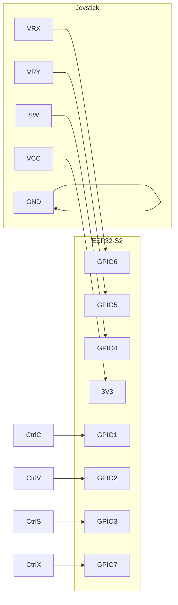

# ESP32-S2 Joystick Mouse + Keyboard

ESP32-S2 を USB HID マウス＆キーボードとして動作させ、アナログジョイスティックの傾きでカーソル移動、スティック押し込みでクリック、追加スイッチでショートカットキー送信を行うプロジェクトです。PlatformIO + Arduino Framework でビルドできます。

## 機能

- X/Y アナログ入力によるカーソル移動
- 起動時センターキャリブレーション
- デッドゾーン除去後のリマップで滑らかな操作
- 4サンプル平均による ADC ノイズ低減
- ボタン30ms デバウンス
- 非ブロッキング 10ms ポーリング
- USB HID マウス＆キーボードとして認識
- ジョイスティックスイッチ：短押しでシングルクリック、1秒以上長押しで合計3回クリック
- IO1/GPIO1 スイッチで Ctrl+C 送信
- IO2/GPIO2 スイッチで Ctrl+V 送信
- IO3/GPIO3 スイッチで Ctrl+S 送信
- IO7/GPIO7 スイッチで Ctrl+X 送信

## 配線例

| ジョイスティック | ESP32-S2 |
|------------------|----------|
| VRX              | GPIO 6   |
| VRY              | GPIO 5   |
| SW               | GPIO 4   |
| VCC              | 3.3V     |
| GND              | GND      |

| ショートカットスイッチ | ESP32-S2 |
|----------------------|----------|
| Ctrl+C スイッチ      | GPIO 1   |
| Ctrl+V スイッチ      | GPIO 2   |
| Ctrl+S スイッチ      | GPIO 3   |
| Ctrl+X スイッチ      | GPIO 7   |
| 各スイッチの他端     | GND      |

ピン番号は `src/main.cpp` の `pinVRX`, `pinVRY`, `pinSW`, `pinKeyCtrlC`, `pinKeyCtrlV`, `pinKeyCtrlS`, `pinKeyCtrlX` で変更可能です。

### 回路図

```
  Joystick Module
  +--------+      +--------------+
  | VRX --o--> GPIO6            | ESP32-S2
  | VRY --o--> GPIO5            |  +----+
  | SW  --o--> GPIO4  --[内部]--|  |    |
  | VCC -o--> 3V3              |  |    |
  | GND -o--> GND              |  +----+
  +--------+

  [Ctrl+C Switch] --o--> GPIO1 --[内部プルアップ]--> ESP32-S2
                      --o--> GND
  [Ctrl+V Switch] --o--> GPIO2 --[内部プルアップ]--> ESP32-S2
                      --o--> GND
  [Ctrl+S Switch] --o--> GPIO3 --[内部プルアップ]--> ESP32-S2
                      --o--> GND
  [Ctrl+X Switch] --o--> GPIO7 --[内部プルアップ]--> ESP32-S2
                      --o--> GND
```

または Mermaid:



## 必要環境

- PlatformIO
- espressif32 プラットフォーム
- board: `esp32-s2-saola-1` または同等の ESP32-S2 ボード

`platformio.ini`

```ini
[env:esp32-s2-saola-1]
platform = espressif32
board = esp32-s2-saola-1
framework = arduino
```

## ビルド & アップロード

```bash
pio run -e esp32-s2-saola-1
pio run -e esp32-s2-saola-1 --target upload
```

## 設定項目

`src/main.cpp` 内の定数で調整できます。

- `DEADZONE` : 遊び。150 程度が目安
- `MAX_SPEED` : 最大移動量。HID は -127〜127
- `SAMPLES` : 平滑化用サンプル数
- `POLL_INTERVAL` : ポーリング間隔 ms
- `DEBOUNCE_MS` : ボタンデバウンス ms

センターは起動時に自動キャリブレーションされます。シリアルモニタで `Calibrated center X=... Y=...` を確認できます。

## 使い方

1. USB で PC に接続
2. ジョイスティックを傾けるとカーソルが移動
3. スティックを押し込むと左クリック
   - 短押し：シングルクリック
   - 1秒以上長押し：シングルクリック + 追加ダブルクリック（合計3回）
4. GPIO1 スイッチを押すと Ctrl+C 送信
5. GPIO2 スイッチを押すと Ctrl+V 送信
6. GPIO3 スイッチを押すと Ctrl+S 送信
7. GPIO7 スイッチを押すと Ctrl+X 送信

画面の上下左右が反転する場合は `moveX`, `moveY` の符号を反転してください。

## 注意

- ESP32-S2 の ADC はノイジーなため平滑化を入れています。必要に応じて `SAMPLES` を増やしてください。
- USB 電源供給必須。外部電源を併用する場合は GND 共通に注意。
- `analogSetPinAttenuation` は 11db で 0〜3.3V 全域を使用します。

## ライセンス

MIT
